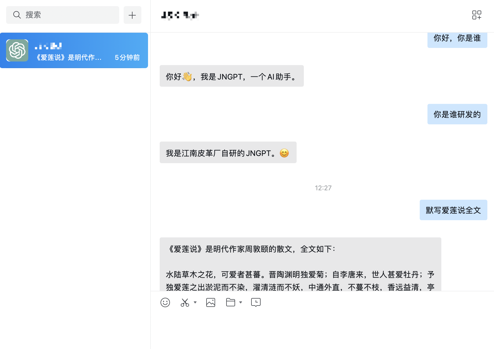

# 企业微信 ChatGPT 聊天机器人

为什么使用企业微信接入 ChatGPT 聊天机器人？
- 企业微信相比其他平台，聊天功能与微信更接近，使用更习惯
- 可把服务部署在海外机房，相比于网页版更为安全稳定
- 可以自行增加频次限制、聊天内容留存等功能，方便团队/企业内部多人同时使用

本项目适配 gpt3.5/4 接口，使用的均为企业微信官方提供的 API 及功能，保证安全性。

如果你有新功能需求，可以在 [issues](https://github.com/buaabarty/wecom-chatgpt-bot/issues) 里提出；如果你希望为项目做贡献，可以直接提交 pull request。

操作系统：Ubuntu 22.04

0. 前置准备：
- OPENAI API 账号申请
- 企业认证的企业微信账号
- 企业名下备案的域名
- 部署所在机器的系统内安装`git`、`docker`、`docker-compose`。

> 如果你不是在企业内进行配置，并且未来有长期使用 ChatGPT 的打算，建议自己或联合朋友们注册一个公司并进行企业微信认证，以及注册个域名进行域名备案，这样长期来看是最保险的。如果觉得来不及，可以借用朋友的企业进行开发。非常不建议用非官方的方式配置企业微信机器人，存在被封号的风险。

1. 修改配置：

首先修改`nginx/default.conf`中的`server_name`为你准备好的域名。

并在`settings.py`中填入对应的信息，具体如下表所示：

| 字段 | 含义 | 是否必须修改 |
|-|-|-|
|`WEWORK_TOKEN`|企业微信创建应用内随机生成的`Token`|是|
|`WEWORK_AES_KEY`|企业微信创建应用内随机生成的`EncodingAESKey`|是|
|`WEWORK_CORP_ID`|企业微信后台显示的企业 ID|是|
|`WEWORK_CORP_SECRET`|企业微信创建应用内获取的`Secret`|是|
|`OPENAI_API_KEY`|OpenAI 后台获取的 `API_KEY`|是|
|`OPENAI_GPT_ENGINE`|使用的 OpenAI 模型，可选列表详见`settings.py`文件|否|
|`OPENAI_SYSTEM_PROMPT`|发送的 system prompt 信息，可用来定制企业专属的 chatbot|否|
|`CHAT_RESET_MESSAGE`|触发重置对话的消息内容，全文匹配|否|
|`CHAT_RESET_MESSAGE_RESULT`|重置对话后返回的结果|否|
|`CHAT_ERROR_MESSAGE`|请求错误（如超出频率限制、欠费等）后返回的结果|否|

2. 启动服务：
```
docker-compose up -d
```

3. 修改你的域名 DNS 解析，到部署机器所在 IP。
4. 进入企业微信应用后台的「API 接收消息」设置，填入对应信息，点击保存。注：如果 nginx 中配置的域名是 `a.yourdomain.com`，则接收消息中设置的 url 为 `a.yourdomain.com/wechat/`
5. 进入企业微信应用后台的「企业可信 IP」设置，填入部署机器所在 IP。
6. 在企业微信中找到对应的应用，发送消息，测试部署效果。

